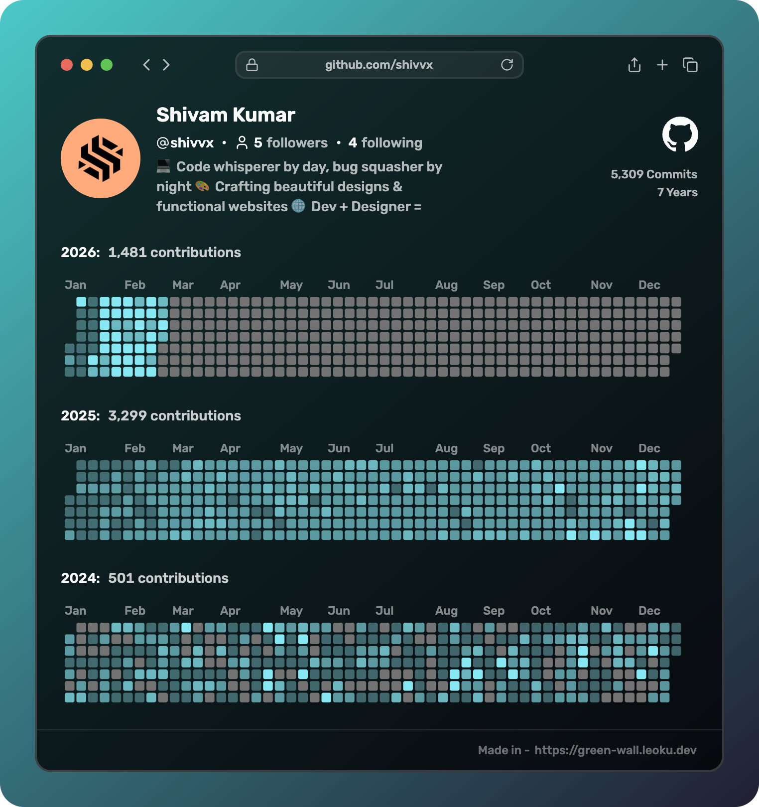

  

<h1 align="center">Designing experiences. Developing dreams. Delivering impact.</h1>
<h3 align="center">
  <a href="https://example.com/" target="_blank"Shivvx</a> · Owner & Ai/Ml | iOS Developer · Creative Designer
</h3>

  
  
  

---

## 🔥 What I Do
- Craft **pixel-perfect UI/UX** and performant **frontend**
- Build **WordPress** products, **WooCommerce** flows & smart **automations**
- Design systems in **Figma** + ship **brand-ready** assets (AE/PR/PS/AI)
- Deploy and maintain **scalable infra** (Azure, Google Cloud, AWS) with CI/CD

---

## 🚀 Tech Stack (at a glance)

  
  

---

## 🧩 Signature Projects
- 🌀 **Discord WP Logger** — Real-time WordPress → Discord logging.  
  `WP` `Hooks` `REST` `Webhooks`
- 💄 **Salon & Makeup Booking** — WhatsApp + Email workflow, approval flows, no-login client UX.  
  `Next.js` `Node` `SMTP` `WA API`
- 🧱 **Shivvx Templates** — Lightweight, modern business sites with automation-first design.  
  `Figma` `Tailwind` `WP`

> Want a demo or code sample? Ping me. I ship fast, clean, and maintainable.

---

## 🤝 Connect

  
  
  
  
  
  
  

---

## 🟡 Contributions

  

---

## 🧠 Mini Bio
I’m **Shivam Kumar**, founder of **Shivvx** — I design and ship **fast, beautiful, automated** web experiences.  
From brand to build to automation, I handle **A → Z** with a focus on **clarity, performance, and results**.

---

## 📩 Hire / Collaborate
- 🔗 Website: **[Shivvx.me](https://Shivvx.me)**
- 💌 Email: **shivprv@icloud.com**
- 💼 Open to: freelance, product collabs, and agency partnerships

---

<!-- Footer -->

   2026 © Shivam Kumar · shivvx.me · Built with love and clean commits.

